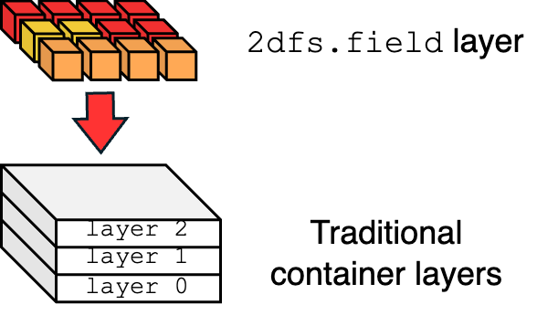
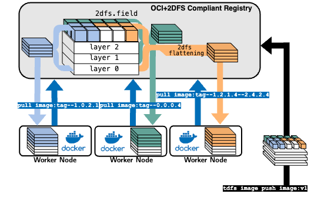

# 2DFS
> ### A two-dimensional filesystem build and distribution framework for containers.

## What is 2DFS?
> An extension of the container layered structure with a new two-dimensional filesystem layer type, specifically designed for efficient handling of large data.

**2DFS** is composed of:

- A new container layer type: `2dfs.field`
- A 2DFS builder, to build a `2dfs.field` on top of a regular OCI container image
- A 2DFS Registry, to host and distribute `2dfs` and OCI compliant images. 
- A 2DFS flattening technique, allowing 2DFS images to be pertitioned on demand and distributed as traditional OCI images for ANY runtime. 

## Features

- **2DFS Builder**: A tool to build 2DFS images from OCI images, with a focus on large data handling. Build performance up to 50x faster than Docker for large data.
- **2DFS Registry**: A registry to host and distribute 2DFS images. It allows image partitioning via semantic tags, enabling on-demand retrieval of only the required data. This is particularly useful for large datasets, AI model partitions, drivers, and other large data files.
- **2DFS Flattening**: A technique to flatten 2DFS images into OCI images, allowing them to be distributed as traditional OCI images for any runtime. This enables the use of 2DFS images in your pre-existing infrastructure, without the need for any changes.

